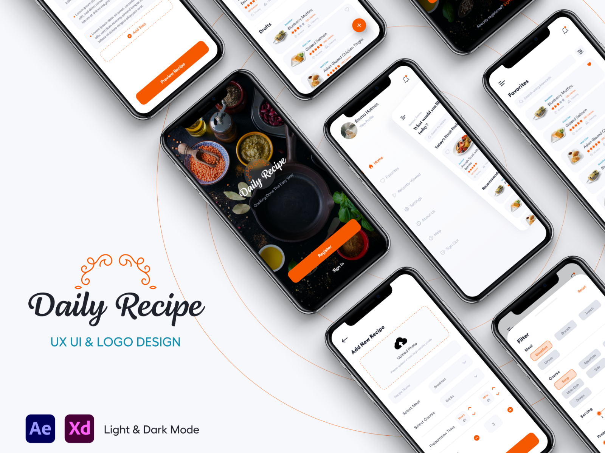
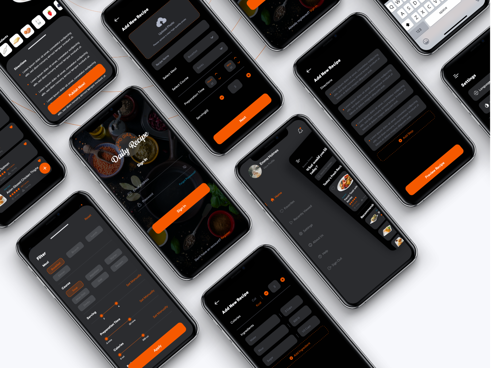

### Would you like to support me?

# Daily Recipe App built with React Native

Inspired from Hend Elgohary https://www.uplabs.com/posts/daily-recipe-light-dark-modes

# Inspiration

## Youtube URL

## Plugins Used

- React Native Fast Image, 
- Redux, 
- Redux-Saga, 
- Redux Toolkit, 
- React Native Actions Sheet, 
- React Native Bottom Sheet, 
- React Navigation v5

## Source URL

- GitHub: https://github.com/jbagaresgaray/React-Native-Daily-Recipe-App

## Demo

There are 2 branch used to here

- master - uses redux, redux-saga and api service to get data from MealDB API
- prototype - uses a fake json file with the same data coming from the Unsplash API

## You can find me on:

- Github: http://github.com/jbagaresgaray
- Twitter: http://twitter.com/Janphil17
- Website: https://jbagaresgaray.github.io/

Wanna give me a coffee?

- Paypal: philipgaray2@gmail.com

